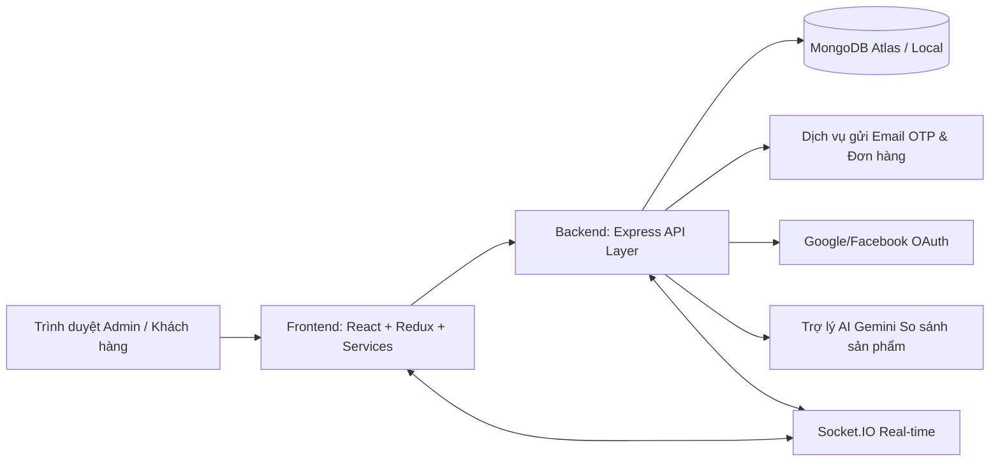

# Bách Hóa XANH - PTIT Software Quality Assurance Project 🛒🌐

Dự án phát triển và đảm bảo chất lượng phần mềm hệ thống thương mại điện tử siêu thị trực tuyến **Bách Hóa XANH** (phát triển và tùy biến dựa trên nền tảng Lotte Mart). Đây là đồ án môn học **Đảm bảo chất lượng phần mềm** tại Học viện Công nghệ Bưu chính Viễn thông (PTIT).

Hệ thống cung cấp cả giao diện người dùng mua sắm trực tuyến (User Client) hiện đại và trang quản lý vận hành doanh nghiệp toàn diện (Admin Dashboard), tích hợp công nghệ web mới nhất cùng kiến trúc RESTful API, Socket.IO truyền thông thời gian thực và xử lý hàng đợi tác vụ nền (background queue).

---

## 🏗️ Kiến trúc hệ thống (Architecture & Topology)

Hệ thống hoạt động theo mô hình Client-Server phân tầng rõ rệt:



### Các lớp hệ thống (System Layers)
1. **Frontend Layer** ([fontend/](file:///c:/Users/LEGION/OneDrive/M%C3%A1y%20t%C3%ADnh/PTIT_%C4%90%E1%BA%A3m%20b%E1%BA%A3o%20ch%E1%BA%A5t%20l%C6%B0%E1%BB%A3ng%20ph%E1%BA%A7n%20m%E1%BB%81m/fontend)):
   - **Framework**: React 19 + TypeScript + Vite.
   - **Styling**: Tailwind CSS v4.
   - **State Management**: Redux Toolkit.
   - **Routing & Guards**: React Router DOM v7 (quản lý phân quyền truy cập Admin, User).
   - **Đặc trưng khác**: Tích hợp Leaflet Map (bản đồ chọn chi nhánh), Three.js (hiển thị mô hình sản phẩm AR), Recharts (biểu đồ thống kê admin).
2. **Backend Layer** ([backend/](file:///c:/Users/LEGION/OneDrive/M%C3%A1y%20t%C3%ADnh/PTIT_%C4%90%E1%BA%A3m%20b%E1%BA%A3o%20ch%E1%BA%A5t%20l%C6%B0%E1%BB%A3ng%20ph%E1%BA%A7n%20m%E1%BB%81m/backend)):
   - **Runtime**: Node.js (ES Modules).
   - **Framework**: Express.js.
   - **Real-time**: Socket.IO (hỗ trợ Live Chat hỗ trợ khách hàng, Giỏ hàng gia đình).
   - **Tác vụ nền**: BullMQ & Redis (hàng đợi xử lý tiến trình gửi mail, cập nhật tồn kho).
   - **Logging**: Winston logger.
3. **Database Layer** (Dữ liệu):
   - **Database**: MongoDB (Mongoose ORM).
   - **Tài liệu tham khảo**: Bản thiết kế cơ sở dữ liệu quan hệ ([database_schema.sql](file:///c:/Users/LEGION/OneDrive/M%C3%A1y%20t%C3%ADnh/PTIT_%C4%90%E1%BA%A3m%20b%E1%BA%A3o%20ch%E1%BA%A5t%20l%C6%B0%E1%BB%A3ng%20ph%E1%BA%A7n%20m%E1%BB%81m/database_schema.sql) & [database-erd-notes.md](file:///c:/Users/LEGION/OneDrive/M%C3%A1y%20t%C3%ADnh/PTIT_%C4%90%E1%BA%A3m%20b%E1%BA%A3o%20ch%E1%BA%A5t%20l%C6%B0%E1%BB%A3ng%20ph%E1%BA%A7n%20m%E1%BB%81m/database-erd-notes.md)) phục vụ quá trình audit chất lượng và chuẩn hóa luồng dữ liệu.

---

## 📁 Cấu trúc thư mục dự án

```text
PTIT_Đảm bảo chất lượng phần mềm/
├── backend/                   # Mã nguồn Backend (Express.js)
│   ├── config/                # Cấu hình kết nối DB, CORS, v.v.
│   ├── controllers/           # Bộ điều khiển xử lý logic nghiệp vụ
│   ├── middlewares/           # Bộ lọc trung gian (Auth, Error, Rate limit)
│   ├── models/                # Định nghĩa Schemas MongoDB (Mongoose)
│   ├── routes/                # Định tuyến APIs
│   ├── seed/                  # Dữ liệu mẫu (seeding) khởi tạo hệ thống
│   ├── services/              # Các dịch vụ nền (gửi email, socket, queue)
│   ├── tests/                 # Các kịch bản kiểm thử API tự động
│   ├── app.js                 # Cấu hình Express App
│   ├── server.js              # Entrypoint khởi chạy server backend
│   └── package.json           # Cấu hình dependencies backend
│
├── fontend/                   # Mã nguồn Frontend (React + TS + Vite) (tên thư mục ghi lỗi chính tả 'fontend')
│   ├── src/
│   │   ├── admin/             # Các trang & thành phần dành cho Admin
│   │   ├── api/               # Định nghĩa các endpoint & Axios client
│   │   ├── components/        # Các UI Components dùng chung
│   │   ├── pages/             # Các trang nghiệp vụ phía người dùng (User)
│   │   ├── slices/            # Quản lý state bằng Redux Slices
│   │   ├── services/          # Các hàm kết nối dịch vụ API & logic nghiệp vụ
│   │   └── utils/             # Chuẩn hóa dữ liệu sản phẩm, định dạng
│   ├── index.html             # Entrypoint HTML chính
│   ├── package.json           # Cấu hình dependencies frontend
│   └── vite.config.ts         # Cấu hình công cụ đóng gói Vite
│
├── map_web/                   # Tài liệu thiết kế hệ thống, sơ đồ luồng & ERD
├── database-erd.drawio        # File sơ đồ quan hệ thực thể (ERD) dạng Draw.io
├── database_schema.sql        # Bản thiết kế lược đồ SQL phục vụ audit
└── package.json               # Package.json ở thư mục gốc giúp chạy đồng thời cả FE & BE
```

---

## 🛠️ Hướng dẫn cài đặt & Khởi chạy dự án

### 1. Yêu cầu hệ thống (Prerequisites)
Hãy đảm bảo máy tính của bạn đã cài đặt các phần mềm sau:
- **Node.js**: Phiên bản `>= 18.x`
- **MongoDB**: Chạy cục bộ (Local MongoDB Community Server) hoặc MongoDB Atlas trực tuyến.
- **Redis**: Cần thiết để khởi chạy hàng đợi `BullMQ` (nếu không có Redis, dịch vụ hàng đợi sẽ log cảnh báo và bỏ qua, server vẫn chạy bình thường ở chế độ Degraded).

### 2. Tải mã nguồn (Git Clone)
Mở terminal và thực hiện lệnh clone dự án từ repository:
```bash
git clone https://github.com/phamcongthanhvn2k6/PTIT_BachHoaXanh_DamBaoChatLuongPhanMem.git
cd PTIT_BachHoaXanh_DamBaoChatLuongPhanMem
```

### 3. Cài đặt các gói phụ thuộc (Dependencies)
Bạn có thể cài đặt nhanh toàn bộ thư viện bằng cách thực hiện tại thư mục gốc của dự án:
```bash
# Cài đặt thư viện cho thư mục gốc
npm install

# Cài đặt thư viện cho Backend
npm install --prefix backend

# Cài đặt thư viện cho Frontend
npm install --prefix fontend
```

### 4. Cấu hình biến môi trường (Environment Variables)

#### 🔸 Cấu hình cho Backend ([backend/](file:///c:/Users/LEGION/OneDrive/M%C3%A1y%20t%C3%ADnh/PTIT_%C4%90%E1%BA%A3m%20b%E1%BA%A3o%20ch%E1%BA%A5t%20l%C6%B0%E1%BB%A3ng%20ph%E1%BA%A7n%20m%E1%BB%81m/backend))
Sao chép tệp mẫu và chỉnh sửa cấu hình:
```bash
cp backend/.env.example backend/.env
```
Mở tệp `backend/.env` và điền các thông tin quan trọng:
```env
PORT=3001
MONGODB_URI=mongodb://localhost:27017/bachhoaxanh  # Hoặc link MongoDB Atlas của bạn
JWT_SECRET=your_jwt_secret_key_here
JWT_REFRESH_SECRET=your_jwt_refresh_secret_key_here

# Dịch vụ gửi email xác thực OTP & Hóa đơn (SMTP)
EMAIL_HOST=smtp.gmail.com
EMAIL_PORT=587
EMAIL_USER=your_email@gmail.com
EMAIL_PASS=your_app_password_here               # Mật khẩu ứng dụng Gmail (App Password)
EMAIL_FROM="Bach Hoa Xanh <no-reply@bachhoaxanh.vn>"

# Lưu trữ ảnh Cloudinary
CLOUDINARY_CLOUD_NAME=your_cloudinary_name
CLOUDINARY_API_KEY=your_cloudinary_key
CLOUDINARY_API_SECRET=your_cloudinary_secret

# Cấu hình AI so sánh sản phẩm (OpenRouter / Gemini)
OPENROUTER_API_KEY=your_openrouter_key
OPENROUTER_MODEL=google/gemini-2.5-flash
```

#### 🔸 Cấu hình cho Frontend ([fontend/](file:///c:/Users/LEGION/OneDrive/M%C3%A1y%20t%C3%ADnh/PTIT_%C4%90%E1%BA%A3m%20b%E1%BA%A3o%20ch%E1%BA%A5t%20l%C6%B0%E1%BB%A3ng%20ph%E1%BA%A7n%20m%E1%BB%81m/fontend))
Sao chép tệp mẫu và chỉnh sửa cấu hình:
```bash
cp fontend/.env.example fontend/.env
```
Mở tệp `fontend/.env` và cấu hình:
```env
VITE_API_HOST=http://localhost:3001
VITE_APP_NAME="Bách hóa XANH"
VITE_GOOGLE_CLIENT_ID=your_google_oauth_client_id  # Dùng đăng nhập bằng Google
```

### 5. Nạp dữ liệu mẫu vào Cơ sở dữ liệu (Seed DB)

* **Cách 1 (Nhanh trên Windows):** Kích đúp chuột vào file [seed_database.bat](file:///c:/Users/LEGION/OneDrive/M%C3%A1y%20t%C3%ADnh/PTIT_%C4%90%E1%BA%A3m%20b%E1%BA%A3o%20ch%E1%BA%A5t%20l%C6%B0%E1%BB%A3ng%20ph%E1%BA%A7n%20m%E1%BB%81m/seed_database.bat) tại thư mục gốc.
* **Cách 2 (Sử dụng dòng lệnh):** Chạy lệnh dưới đây từ terminal:
  ```bash
  npm run seed --prefix backend
  ```

> 🔑 **Tài khoản quản trị mặc định sau khi seed thành công:**
> - **Email**: `admin@lottemart.vn`
> - **Mật khẩu**: `Admin@123`

### 6. Khởi chạy dự án (Development Mode)

* **Cách 1 (Nhanh trên Windows):** Kích đúp chuột vào file [run_project.bat](file:///c:/Users/LEGION/OneDrive/M%C3%A1y%20t%C3%ADnh/PTIT_%C4%90%E1%BA%A3m%20b%E1%BA%A3o%20ch%E1%BA%A5t%20l%C6%B0%E1%BB%A3ng%20ph%E1%BA%A7n%20m%E1%BB%81m/run_project.bat) ở thư mục gốc. File này sẽ tự động kiểm tra và cài đặt thư viện (`npm install`) nếu máy bạn chưa cài đặt, sau đó chạy cả Frontend và Backend song song.
* **Cách 2 (Sử dụng dòng lệnh):** Nhờ cấu hình `concurrently` ở tệp [package.json](file:///c:/Users/LEGION/OneDrive/M%C3%A1y%20t%C3%ADnh/PTIT_%C4%90%E1%BA%A3m%20b%E1%BA%A3o%20ch%E1%BA%A5t%20l%C6%B0%E1%BB%A3ng%20ph%E1%BA%A7n%20m%E1%BB%81m/package.json) gốc, bạn chỉ cần thực hiện 1 lệnh duy nhất tại thư mục gốc để khởi chạy đồng thời cả hai phần:
  ```bash
  npm run dev
  ```

- **Backend API**: Chạy tại [http://localhost:3001](http://localhost:3001)
- **Frontend App**: Chạy tại [http://localhost:5173](http://localhost:5173)

### 7. Chạy kiểm thử API (Testing)
Để chạy các ca kiểm thử tự động (API Integration Tests) cho backend:
```bash
npm test --prefix backend
```

---

## ✨ Các tính năng chính của hệ thống

### 🙍 Phía khách hàng (User Client)
- **Khám phá & Tìm kiếm**: Lọc sản phẩm theo danh mục, xuất xứ, thương hiệu, giá cả. Hỗ trợ xem ảnh 360 độ và mô hình 3D AR.
- **So sánh sản phẩm tích hợp AI**: Cho phép so sánh chi tiết 2 sản phẩm và sử dụng AI Gemini để tóm tắt, đưa ra nhận định/khuyên dùng thông thái.
- **Giỏ hàng & Thanh toán**: Chọn chi nhánh giao hàng gần nhất (đồng bộ qua Leaflet Map), chọn ca giao hàng trong ngày, áp dụng Voucher/Coupon từ ví và quét mã QR giả lập để hoàn tất đặt hàng.
- **Giỏ hàng gia đình (Family Cart)**: Tính năng mua sắm nhóm thời gian thực (Socket.IO). Người tạo có thể đặt hạn mức ngân sách, xét duyệt sản phẩm do các thành viên khác thêm vào và nhắn tin trò chuyện nhóm trực tiếp.
- **Ví ưu đãi & Nhiệm vụ (Gamification)**: Nhận điểm thưởng tích lũy (Loyalty Points), điểm danh nhận quà và theo dõi các chương trình ưu đãi hiện hành.
- **Quản lý tài khoản**: Sổ địa chỉ giao hàng, lịch sử đơn hàng & hành trình vận chuyển (Tracking), lịch sử đánh giá sản phẩm.

### 👑 Phía quản trị viên (Admin Dashboard)
- **Báo cáo & Thống kê**: Trực quan hóa doanh số bán hàng, số lượng đơn hàng, lượng khách hàng đăng ký mới theo thời gian thực bằng biểu đồ trực quan.
- **Quản trị catalog**: Quản lý chi tiết sản phẩm, giá bán, danh mục hàng hóa, theo dõi lịch sử thay đổi giá bán.
- **Quản lý Kho hàng & Chuỗi cung ứng**: Quản lý danh sách nhà cung cấp (Suppliers), lập đơn nhập kho (Import Order), quản lý lô hàng nhập thực tế (Import Receipt) và phân tích các lô hàng hết hạn (Inventory Batch).
- **Quản lý Marketing**: Tạo các sự kiện (Events), bài đăng quảng bá, cấu hình banner quảng cáo trang chủ và thiết lập các kịch bản ưu đãi tự động.
- **Phân quyền nâng cao (RBAC)**: Phân chia vai trò (Admin, Thủ kho, Thu ngân, v.v.), chỉ định quyền hạn hành động chi tiết và ghi nhật ký hoạt động (Audit Logs) để kiểm soát chất lượng vận hành.

---

## 🔍 Đánh giá chất lượng & Điểm cần lưu ý (Quality & Audit Notes)

Dự án được xây dựng và kiểm soát chất lượng dựa trên các tiêu chí nghiêm ngặt của môn học **Đảm bảo chất lượng phần mềm**:
- **Chuẩn hóa dữ liệu (Data Normalization)**: Phía frontend sử dụng module bộ chuẩn hóa tại [productNormalization.ts](file:///c:/Users/LEGION/OneDrive/M%C3%A1y%20t%C3%ADnh/PTIT_%C4%90%E1%BA%A3m%20b%E1%BA%A3o%20ch%E1%BA%A5t%20l%C6%B0%E1%BB%A3ng%20ph%E1%BA%A7n%20m%E1%BB%81m/fontend/src/utils/productNormalization.ts) nhằm khắc phục các điểm không tương thích trường dữ liệu giữa API backend Mongoose Model và mockData mẫu.
- **Quản lý ID**: Dự án sử dụng cấu trúc `Mixed` ID trong MongoDB để hỗ trợ cả ID định dạng Mongo ObjectId lẫn ID dạng chuỗi từ mockData, hạn chế tối đa các lỗi so sánh kiểu dữ liệu ở frontend.
- **Bảo mật API**: Đã cấu hình Rate Limiting bằng `express-rate-limit` để ngăn chặn các cuộc tấn công Brute-force hoặc DDoS diện rộng vào các endpoint nhạy cảm (như đăng nhập, lấy OTP).

---

Chúc bạn có những trải nghiệm tuyệt vời khi kiểm thử và sử dụng sản phẩm! Để biết thêm thông tin chi tiết về sơ đồ thiết kế hoặc nghiệp vụ, vui lòng tham khảo các tài liệu liên quan trong thư mục [map_web/](file:///c:/Users/LEGION/OneDrive/M%C3%A1y%20t%C3%ADnh/PTIT_%C4%90%E1%BA%A3m%20b%E1%BA%A3o%20ch%E1%BA%A5t%20l%C6%B0%E1%BB%A3ng%20ph%E1%BA%A7n%20m%E1%BB%81m/map_web).
