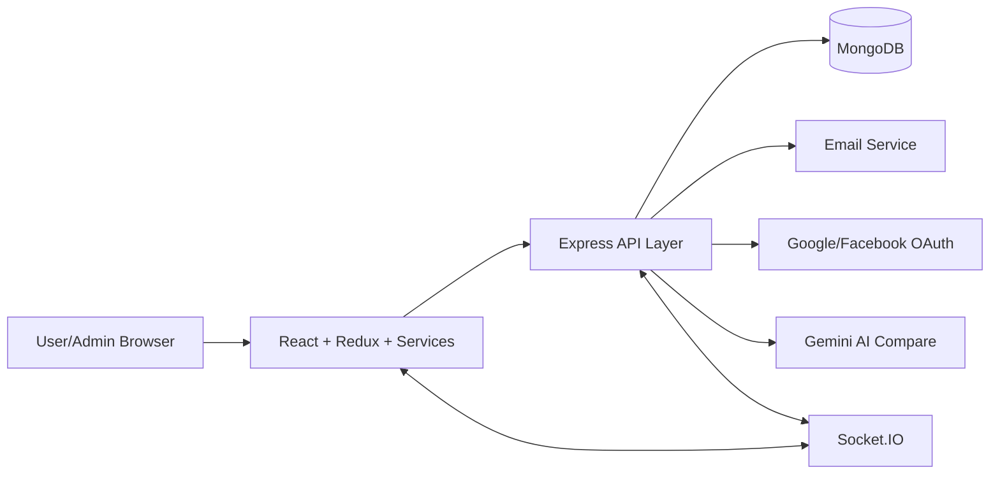
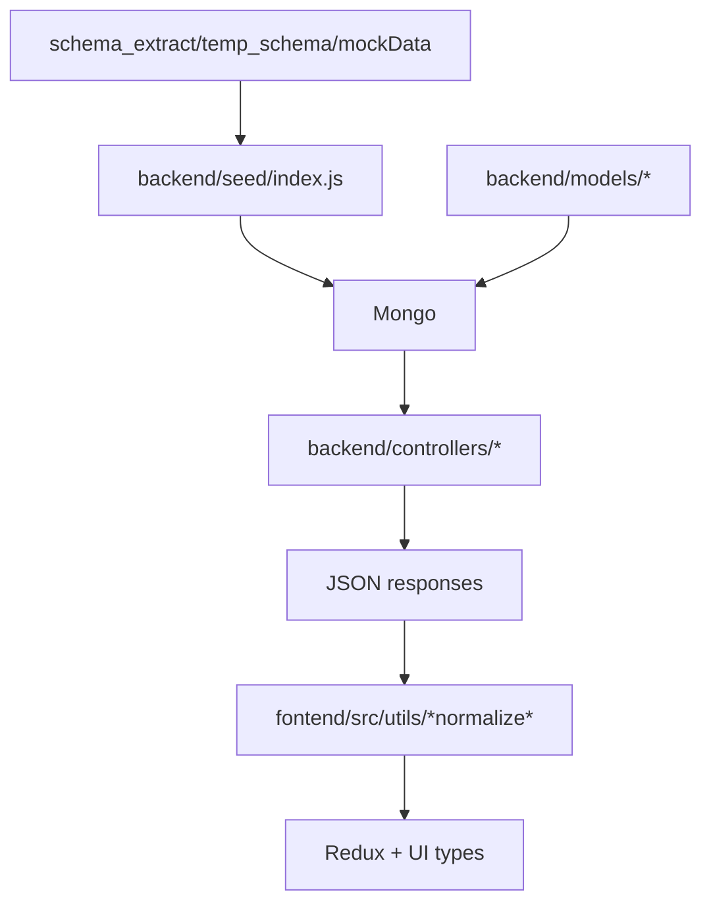

# Architecture Re-Audit (Synced With Full Data Model)

## 1. System Topology

## 2. Runtime Layers

### Frontend Layer
Primary files:
- [fontend/src/App.tsx](../fontend/src/App.tsx)
- [fontend/src/api/httpClient.ts](../fontend/src/api/httpClient.ts)
- [fontend/src/api/endpoints.ts](../fontend/src/api/endpoints.ts)
- [fontend/src/services](../fontend/src/services)
- [fontend/src/utils/productNormalization.ts](../fontend/src/utils/productNormalization.ts)

Responsibilities:
- Routing, guards (Auth/Admin/Permission).
- Endpoint abstraction and token refresh queue.
- Data normalization from mixed backend/sample payloads.
- UI state in Redux slices.

### Backend Layer
Primary files:
- [backend/app.js](../backend/app.js)
- [backend/server.js](../backend/server.js)
- [backend/routes](../backend/routes)
- [backend/controllers](../backend/controllers)
- [backend/services](../backend/services)

Responsibilities:
- Route mount and compatibility aliases.
- Domain controllers + transactional services.
- RBAC/marketing bootstrap seeders.
- Socket handlers for support tickets.

### Data Layer
Primary schema sources:
- [backend/models](../backend/models)
- Seed projection sources: [backend/seed/index.js](../backend/seed/index.js), [fontend/mockData.json](../fontend/mockData.json)

Important architectural decision now documented:
- Canonical persistence contract is Mongoose schema.
- Sample docs and FE payloads are treated as compatibility overlays and explicitly tracked for drift.

## 3. Bounded Contexts And Entity Ownership

### Identity And Access
- Entities: User, Role, Permission.
- Owner modules: auth/admin/role/permission controllers.
- Notable contract update in this re-audit:
  - User schema now includes profile settings/security wallet fields to match FE settings usage.

### Catalog And Availability
- Entities: Category, Product, Branch, BranchProduct.
- Owner modules: product/category/branch/branchProduct controllers.
- Notable contract update in this re-audit:
  - Product schema aligned with rich FE/product-detail fields (highlights/rating_breakdown/gallery/etc.).
  - Category schema aligned with description/display_order fields used in admin FE.

### Commerce
- Entities: Cart, Order, PaymentMethod, PaymentTransaction, PaymentProvider.
- Owner modules: cart/checkout/order/payment controllers.
- Constraint: many order/payment fields are snapshot+denormalized for auditability.

### Promotions And Vouchers
- Entities: Promotion, Coupon, PromotionClaim, PromotionUsage, CouponClaim, CouponUsage.
- Owner modules: promotion/coupon controllers + checkout flow.
- Known architecture risk: duplicated field declarations in Promotion schema.

### CX And Engagement
- Entities: ViewedHistory, Review, SupportTicket, Notification, LoyaltyTransaction, LoyaltyRule, ReturnRequest.
- Owner modules: viewHistory/review/support/notification/loyalty/returnRequest controllers.

### Enterprise Inventory
- Entities: Supplier, ImportOrder, ImportReceipt, InventoryBatch, StockMovement.
- Owner modules: enterprise services and inventory controllers.
- Known architecture risk: duplicate StockMovement model in Misc and dedicated model file.

## 4. Data Contract Pipeline (After Re-Audit)

Key rule:
- Every field in FE critical rendering paths must be traceable to either schema-defined or explicit compatibility mapping.

## 5. High-Risk Architectural Drifts
1. BranchProduct sample payload carries fields not in schema (`badges`, `policies`, `lead_time_days`, `status`, `last_updated`).
2. Order sample schema exposes tax/pickup/payment alias fields not modeled explicitly in Order schema.
3. Duplicate StockMovement model definitions can cause divergent writes.
4. Mixed ID strategy (`Mixed` everywhere) increases normalization complexity and cross-layer casting bugs.

## 6. What Was Implemented In This Pass
- Extended data schemas for Product/User/Category to match observed sample + FE usage.
- Extended seed mapping so these fields are not lost when writing to Mongo.
- Updated FE Product/Category types for compatibility and reduced implicit-any drift.
- Rebuilt architecture/data docs to reflect source-of-truth hierarchy and mismatches.

## 7. Architectural Readiness Summary
- Core commerce runtime: stable and connected.
- Contract fidelity improved for Product/User/Category.
- Remaining architecture debt is concentrated in:
  - duplicated models,
  - alias naming drift,
  - placeholder enterprise endpoints,
  - mixed-id normalization.
